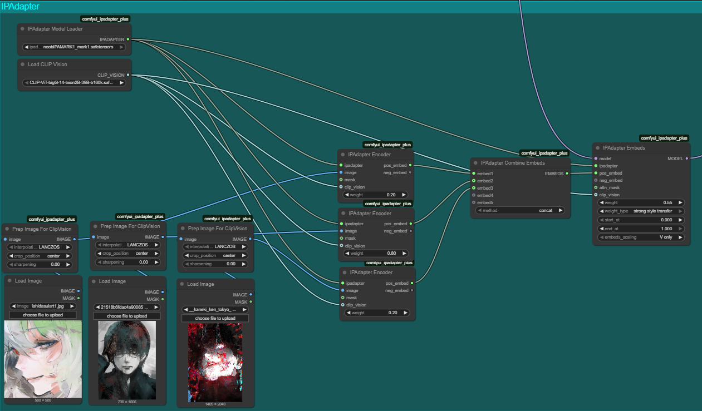
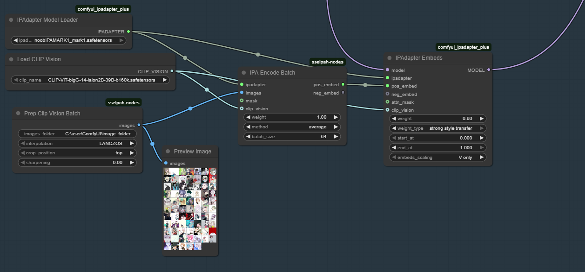

# ComfyUI-sselpah-nodes
> [!IMPORTANT]
> Full credit to this repository and the people who worked on it: https://github.com/cubiq/ComfyUI_IPAdapter_plus/tree/main
> This project is basically 95% ComfyUI_IPAdapter_plus code.

>[!IMPORTANT]
> **I hold 0% knowledge on the technicals of IP Adapter so feel free to contribute code AND knowledge to this repository.**

## **You need to have ComfyUI_IPAdapter_plus installed to fully utilize the nodes in this pack!!!** Right now this repository contains nodes that extend ComfyUI_IPAdapter_plus capabilities, **IT IS NOT A REPLACEMENT**

## What is this?
IP Adapter is "Image Prompting Adapter", using this you can prompt an image using an image in addition to using text, this whole process takes in an image, extracts its "features" using a Clip Vision model and inserts those features into your model.
I consider this functionally a "lightweight LoRA".

the problem with the ComfyUI_IPAdapater_plus pack that it is hard to use many images in IPAdapter, as you can see in the following image the more images you want to use the more spaghetti you're going to have:

the solution is replacing the workflow above with this one:

by using the following setup you could take an image dataset (hopefully of any size) you planned on training for hours and test it in minutes without training, it transfers styles very well but haven't been tested with concepts like poses, objects, characters, though logically it should work.

## How to install
run this command in custom_nodes folder and restart ComfyUI

`git clone https://github.com/sselpah/ComfyUI-sselpah-nodes.git`

## How to use
### Prep Clip Vision Batch (in sselpah pack)
This node was edited to take in a path to a folder of images and downscales them to 224x224, recommended settings are:
* **interpolation**: LANCZOS - downscaling method
* **crop_position**: center - for each image it would crop relative to this position and then downscale

### IPAEncoderBatch (in sselpah pack)
This node (IPAdapter Encoder) was edited to take in a batch of images AND combine their embeds by running it through the Clip Vision model (so you won't need IPAdapter Embeds Combine), recommended settings are:
* **weight**: 1.00 - weight for each image embed, in the future we could apply different weights for different images to give them more emphasis, don't confuse with IPAdapter Embeds node weights which controls how strongly the embeds are applied to the model
* **method**: average - different methods to combine the embeds, I personally found average giving good results but feel free to experiment
* **batch_size**: 64 - controls how many images get processed through the Clip Vision at once, the bigger the number the more VRAM it's going to use, ComfyUI knows how to cache the output of this node so it won't run each generation unless you change the inputs (and you can also save it using a different node)

### IPAdapter Embeds
This node is a part of ComfyUI_IPAdapter_plus, it was not edited and should be taken from there, it takes in embeds and applies them to the model, recommended settings are:
* **weight**: 0.5 - weight for how strongly the embeds would be applied to the model over each step
* **pos_embed** - positive embeds, model will "inherit" the features from those embeds
* **neg_embed**: (empty) - negative embeds, common sense say it's like negative prompts, I don't know though, experiment and tell me.
* **weight_type**: strong_style_transfer - different methods of applying the embeds to the model, just experiment.
* **start_at**: 0.000 - from which step to start applying the embeds
* **end_at**: 0.000 - at which step to end applying the embeds
* **embed_scaling**: V only - once again, I don't know.

### IPA Load Embeds/IPA Save Embeds
Those two nodes were edited from the original ComfyUI_IPAdapter_plus because the original ones load from input folder and save to output folder which mixes in with images and I don't like that.
My edit makes them load and save from the folder `models/ipadapter/embeds`, once you save an embed you can use it instead of the IPAEncoderBatch

## Plans for the upcoming future
* TONS of experiments with different image datasets of different sizes, concepts, steps, new weight methods, masks (different datasets for different parts of the image), and more.
* Add weight to the IPA Load Embeds (if possible after saving it).
* Add multi-processing for Prep Clip Vision Batch for large image datasets.
* In the case where a dataset is also tagged (tag txt file per image) allow Prep Clip Vision Batch to easily process images only with the tags the user specified in the input (text prompting the image prompting)
